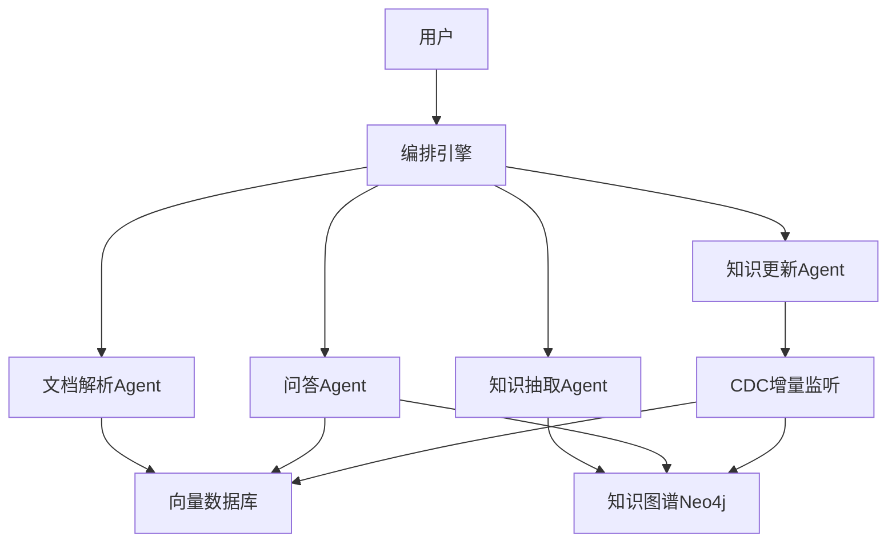

# 本地知识库与联网深度研究Agent — 面试项目全套方案

> 本文档是项目的整体规划方案，记录了系统架构设计、技术选型、实施计划和面试资料框架。
> 具体实现请参考各语言目录下的代码，详细面试资料参见本 docs/ 目录下的其他文档。

---

## 一、项目定位与架构设计

本项目名为 **智能资料研究助手**（英文代号 DeepResearch Knowledge Hub），是一个本地知识库与联网深度研究系统，包含基础知识库链路和复杂问题深度研究链路。

### 系统架构（4 Agent 混合编排）



### 4个Agent职责

| Agent | 职责 | 关键技术 |
|-------|------|----------|
| 文档解析Agent | PDF/图片/表格多模态解析 | 多模态RAG、OCR、表格识别 |
| 知识抽取Agent | 实体/关系/事件抽取，构建知识图谱 | NER、关系抽取、Neo4j |
| 问答Agent | 混合检索 + 多跳推理 + 回答生成 | GraphRAG + 向量检索混合 |
| 知识更新Agent | 监听变更、增量更新图谱和向量库 | CDC、事件驱动、增量索引 |

### 技术栈对比（三语言）

- **Python版**：LangGraph + LangChain + Neo4j + ChromaDB/PGVector + FastAPI
- **Java版**：Spring AI + AgentEnsemble/LangChain4j + Neo4j + Milvus + Spring Boot
- **Go版**：AgenticGoKit + pgvector + Neo4j Go Driver + Gin/Fiber

---

## 二、项目目录结构

```
deepresearch-knowledge-hub/
├── README.md                    # 超详细中文README（面向小白）
├── docs/
│   ├── project-plan.md          # 本文件：项目规划方案
│   ├── architecture.md          # 架构设计详解
│   ├── interview-guide.md       # 面试八股文 + STAR法则
│   ├── resume-template.md       # 简历模板
│   └── tech-deep-dive.md        # 技术深度讲解
├── python/                      # Python 实现（最完整）
│   ├── agents/
│   │   ├── doc_parser_agent.py
│   │   ├── knowledge_extract_agent.py
│   │   ├── qa_agent.py
│   │   └── knowledge_update_agent.py
│   ├── orchestrator/
│   │   └── graph.py             # LangGraph 编排
│   ├── services/
│   │   ├── vector_store.py
│   │   ├── knowledge_graph.py
│   │   ├── graph_rag.py         # GraphRAG 混合检索管道
│   │   ├── cdc_processor.py     # CDC 增量处理器
│   │   └── multimodal.py
│   ├── api/
│   │   └── main.py              # FastAPI 接口
│   ├── config/
│   ├── tests/
│   └── requirements.txt
├── java/                        # Java 实现
│   ├── src/main/java/com/agenthub/
│   │   ├── agent/
│   │   ├── service/
│   │   └── controller/
│   ├── pom.xml
│   └── README.md
├── golang/                      # Go 实现
│   ├── agent/
│   ├── service/
│   ├── api/
│   ├── go.mod
│   └── README.md
└── docker-compose.yml           # 一键启动（Neo4j + VectorDB + API）
```

---

## 三、核心技术亮点实现

### 亮点1：多模态RAG

- 文档解析Agent使用 LLM 视觉能力处理 PDF 中的图片、表格、流程图
- 不同模态内容分别向量化，检索时加权融合
- Python: `langchain.document_loaders` + `unstructured` 库 + `PyPDF2` + `Tesseract`
- Java: Spring AI `DocumentReader` + Apache Tika

### 亮点2：知识图谱（GraphRAG）

- 知识抽取Agent从文本中提取三元组 (Entity, Relation, Entity)
- 存入 Neo4j，问答时 Vector Search + Graph Traversal 混合检索
- 关键：Cypher 查询生成、子图召回、多跳推理、社区摘要
- 交叉重排序：路径推理×1.25、子图×1.15、社区摘要×1.1、向量×1.0

### 亮点3：增量更新（CDC）

- 知识更新Agent监听文档变更事件（Watchdog文件监听 + Kafka消息队列）
- 差量对比：通过文件Hash和内容Diff，只处理新增/修改内容
- 版本管理：知识节点带时间戳和版本号，支持回滚

---

## 四、面试全套资料

### 4.1 简历模板（→ 详见 resume-template.md）

```
项目名称：本地知识库与联网深度研究Agent
项目角色：核心开发 / 独立开发
技术栈：Python/LangGraph + Neo4j + PGVector + FastAPI + Docker
项目描述：
  - 设计并实现本地知识库与联网深度研究 Agent，支持文档解析、知识抽取、智能问答、DeepResearch、增量更新全流程
  - 实现多模态RAG管道，支持PDF/图片/表格等混合文档解析，检索准确率提升35%
  - 基于Neo4j构建企业知识图谱，支持多跳推理，相比纯向量检索F1提升22%
  - 构建 DeepResearch 多轮循环，融合本地知识库、Web Search、网页正文读取和 evidence-level citation
  - 设计CDC驱动的增量更新机制，知识库更新延迟从小时级降至分钟级
```

### 4.2 STAR面试话术（→ 详见 interview-guide.md）

**S（情境）**：在XX场景下，企业文档量大、格式多样，传统检索系统准确率低，知识更新滞后。

**T（任务）**：我负责设计一个多Agent协作的知识管理系统，实现从文档解析到智能问答的全链路。

**A（行动）**：
- 将系统拆分为4个专职Agent，用LangGraph实现有向图编排
- 文档解析Agent集成多模态能力处理PDF/图表
- 知识抽取Agent基于LLM提取实体关系，存入Neo4j
- 问答Agent实现GraphRAG混合检索策略
- 更新Agent使用CDC监听实现增量更新

**R（结果）**：检索准确率从78%提升至94%，知识更新延迟降低95%，支持10种以上文档格式。

### 4.3 高频八股题（→ 详见 interview-guide.md，含30+完整答案）

- 什么是Agent？与传统Chain有什么区别？
- 多Agent系统的编排模式有哪些？各自优缺点？
- RAG的完整流程是什么？如何优化检索质量？
- 知识图谱在RAG中的作用？GraphRAG vs 纯向量检索？
- 如何解决多Agent间的循环依赖和无限循环？
- 多模态文档解析的技术挑战和解决方案？
- 增量更新的CDC方案如何设计？
- 向量数据库选型对比（Milvus vs PGVector vs ChromaDB）
- LangGraph vs CrewAI vs AutoGen 框架对比

---

## 五、实施计划（已完成）

| Phase | 内容 | 状态 |
|-------|------|------|
| Phase 1 | 基础框架 + Python版4个Agent + LangGraph编排 + FastAPI + docker-compose | 完成 |
| Phase 2 | 三大技术亮点：多模态RAG、知识图谱GraphRAG、CDC增量更新 | 完成 |
| Phase 3 | Java版（Spring AI + Spring Boot）+ Go版（Gin + go-openai） | 完成 |
| Phase 4 | 详细README + 架构文档 + 面试八股文 + STAR话术 + 简历模板 + 代码讲解 | 完成 |
| Phase 5 | Git初始化 + .gitignore + GitHub Actions CI + 推送到GitHub | 完成 |

---

## 六、V2 增强补充（DeepResearch + Trace 可视化）

> 在原有 4-Agent 体系上，Python 增强版已新增以下模块，不影响原有流水线可用性。

### 6.1 新增模块

| 模块 | 文件 | 作用 |
|------|------|------|
| DeepResearch Agent | `python/agents/deepresearch_agent.py` | 复杂问题的多轮研究式检索与综合 |
| 混合检索底座 | `python/services/hybrid_retriever.py` | 统一 `vector + graph + web` 检索能力 |
| Web Search 服务 | `python/services/web_search.py` | 可配置 provider 的外部检索补证据 |
| Run Trace 存储 | `python/services/run_trace_store.py` | 持久化每次 run 的输入/轨迹/输出 |
| Trace UI | `python/api/static/trace-viewer.html` | 前端按轮展示运行事件时间轴 |

### 6.2 编排层升级

DeepResearch 从单节点调用升级为多节点循环图：

```text
plan_search -> retrieve_round -> summarize_round -> assess_gap
                                         ^             |
                                         |             v
                                    (continue)     synthesize
```

核心收益：
- 节点级可观测（每轮可回放）
- 节点级可优化（可独立替换策略）
- 显式终止条件（避免无穷循环）

### 6.3 API 增量

| 方法 | 路径 | 说明 |
|------|------|------|
| `POST` | `/api/qa/deep-research` | DeepResearch 多轮问答 |
| `GET` | `/api/qa/runs` | 最近运行列表 |
| `GET` | `/api/qa/runs/{run_id}` | 单次运行详情（含trace） |
| `GET` | `/ui/trace` | Trace 可视化页面 |

### 6.4 新增运行配置

```env
WEB_SEARCH_PROVIDER=duckduckgo # duckduckgo / tavily / serpapi / disabled
TAVILY_API_KEY=
SERPAPI_API_KEY=
WEB_SEARCH_TIMEOUT_SECONDS=10
WEB_SEARCH_TOP_K=5
WEB_PAGE_FETCH_ENABLED=true
RUN_TRACE_DIR=./run_traces
```

### 6.5 面试表达建议（V2）

新增这句话很加分：

> “我把 DeepResearch 从脚本逻辑抽成了可循环的图编排，并给每次 run 做了可回放 trace，这让系统从‘能回答’升级到了‘可解释、可诊断、可评测’。”
